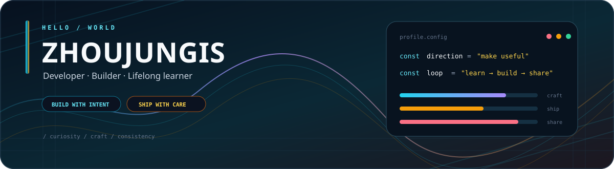
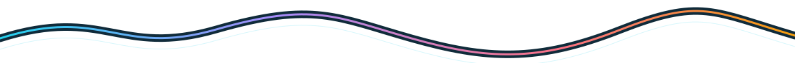
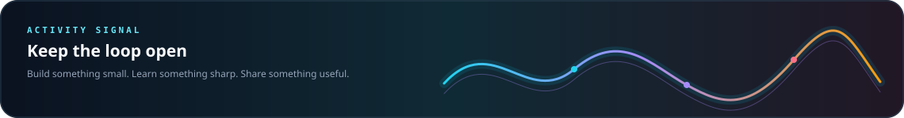
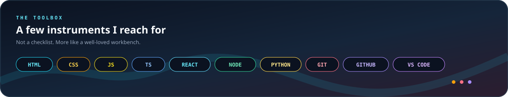
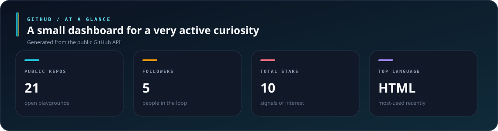
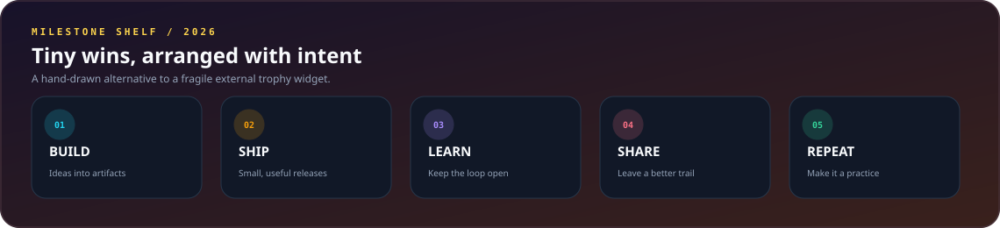

  <strong>THE WORKSPACE OF ZHOUJUNGIS</strong> 
  把模糊的想法，慢慢打磨成值得使用的东西。

## 00 / The short version

<table>
  <tr>
    <td width="42%" valign="top">
      <h3>Make it useful.</h3>
      
I like interfaces that feel calm, tools that remove friction, and code that stays readable after the excitement wears off.

      
<strong>Developer · Builder · Lifelong learner</strong>

    </td>
    <td width="58%" valign="top">
      <pre>
  curiosity  →  craft  →  ship
       ↑                   ↓
       └────── learn ──────┘
      </pre>
      
每一次提交，都是下一次迭代的起点。

    </td>
  </tr>
</table>

## 01 / Current orbit

  <code>BUILD SMALL</code>&nbsp;&nbsp; <code>LEARN SHARP</code>&nbsp;&nbsp; <code>SHARE OFTEN</code>

## 02 / The toolbox

## 03 / A glance at the signal

## 04 / Doorways

不把仓库伪装成作品集，也不把作品集写成流水账。这里有两扇门，进去看看就好。

<table>
  <tr>
    <td align="center"></td>
  </tr>
  <tr>
    <td align="center"></td>
  </tr>
</table>

## 05 / Live elsewhere

<table>
  <tr>
    <td align="center"> zhoujungis.github.io</td>
    <td align="center"> happy-games.pages.dev</td>
    <td align="center"> halo-music.pages.dev</td>
  </tr>
  <tr>
    <td align="center"> routewise-ai.pages.dev</td>
    <td align="center"> destiny-ai.pages.dev</td>
    <td align="center"> github.com/zhoujungis</td>
  </tr>
</table>

## 06 / Tiny wins, arranged with intent

## 07 / Keep in touch

 
Open to thoughtful conversations, interesting problems, and meaningful collaborations.

## 08 / Contribution rhythm

Hand-drawn SVG · refreshed weekly by <a href=".github/workflows/update-contribution-calendar.yml">GitHub Actions</a>

