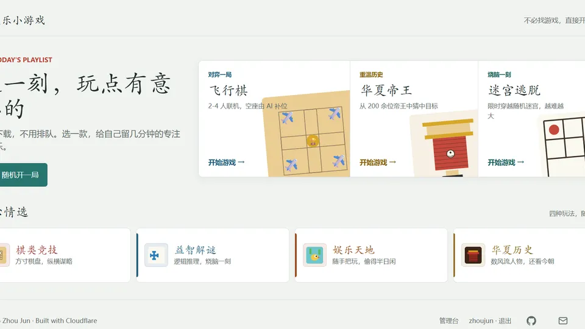
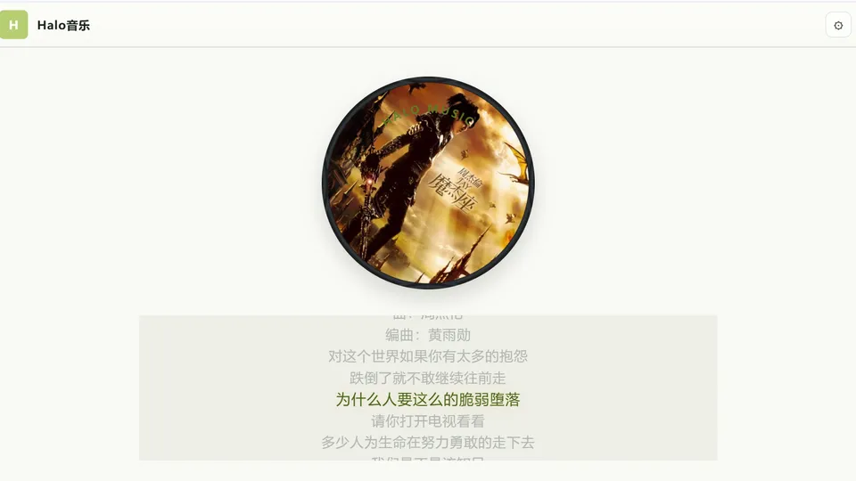
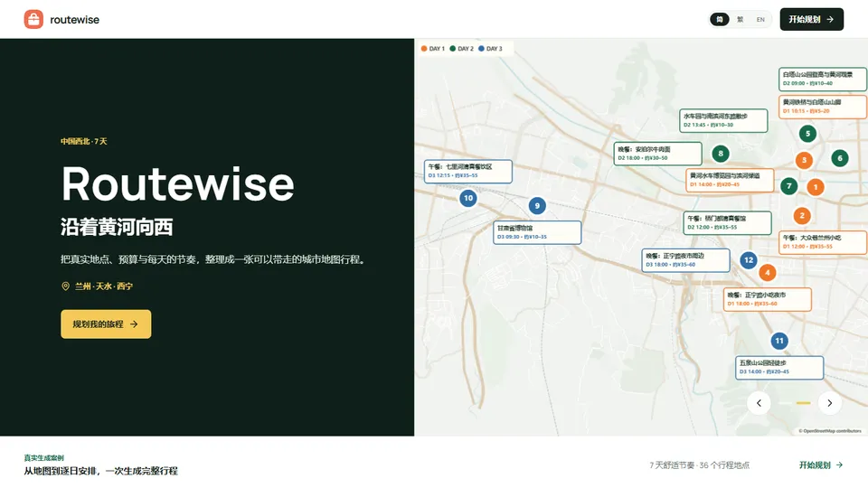
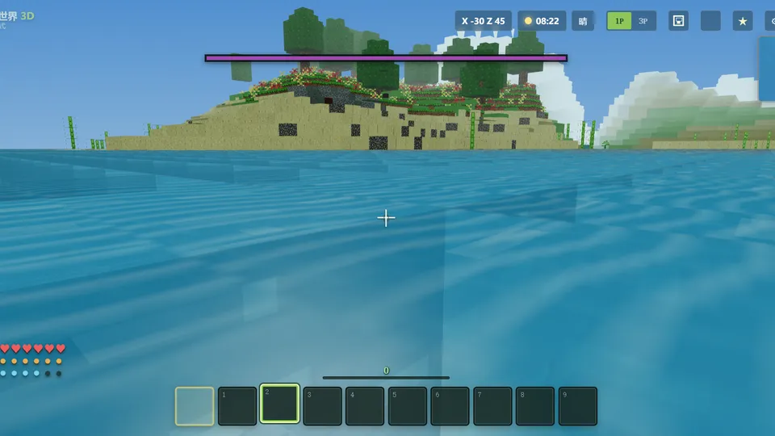

FIELD NOTES / 2026 &nbsp;·&nbsp; ZJ // 001
<h1>ZHOUJUNGIS</h1>

<strong>把想法，做成东西。</strong>

DEVELOPER &nbsp;/&nbsp; BUILDER &nbsp;/&nbsp; LIFELONG LEARNER

  
  
  

<table>
  <tr>
    <td width="33%" align="center" valign="top">01 / START  <strong>先做出来</strong> <small>让想法先拥有一个可以打开的形状。</small></td>
    <td width="34%" align="center" valign="top">02 / TUNE  <strong>再磨好用</strong> <small>让真实的使用决定下一次修改。</small></td>
    <td width="33%" align="center" valign="top">03 / SHARE  <strong>最后留下</strong> <small>让作品继续被看见、被使用、被改进。</small></td>
  </tr>
</table>

<h2>01 / Workshop notes</h2>

  
  
  

<table>
  <tr>
    <td width="32%" align="center" valign="middle">
      WORK MODE / 01
      <h2>BUILD SMALL</h2>
      
<code>MAKE</code> <code>LEARN</code> <code>SHARE</code>

      
curiosity in friction out

    </td>
    <td width="68%" valign="top">
      01 / TOOLS I REACH FOR
      <h3>从浏览器开始，不从框架开始。</h3>
      
我喜欢先把一个想法放进真实的页面里，再决定它需要什么技术。能被打开、能被操作、能收到反馈，才算真正开始。

      
<code>HTML</code> <code>CSS</code> <code>JavaScript</code> <code>TypeScript</code> 
      <code>React</code> <code>Node.js</code> <code>Python</code> <code>Git</code>

      
STACK / interface · interaction · systems

      

      02 / RULES OF THE DESK
      <h3>先让它能用，再让它值得留下。</h3>
      
把复杂的东西讲清楚，把有趣的东西做出来，也给下一次改进留一点空间。每次迭代只解决真正影响体验的那一个摩擦点。

      
<code>quiet UI</code> <code>clear edges</code> <code>fast feedback</code> <code>small steps</code> <code>real users</code> <code>open notes</code>

      
FILTER / clarity · feedback · iteration

    </td>
  </tr>
</table>

IDEA &nbsp;&rarr;&nbsp; PROTOTYPE &nbsp;&rarr;&nbsp; FRICTION &nbsp;&rarr;&nbsp; REFINEMENT

<h2>02 / Live builds</h2>

<table>
  <tr>
    <td width="50%" valign="top">
      
      <h3><a href="https://happy-games.pages.dev/">01 / Happy Games</a></h3>
      
 

      
<strong>把“打开就玩”当作第一条产品原则。</strong>

      
这个站点把注意力放在游戏本身，而不是复杂的入口和说明上。它更像一个持续收集中的网页游戏实验室：每一次点击都应该尽快得到反馈，每一个小玩法都可以独立成立。对我来说，它练习的是交互节奏、状态反馈和“让用户马上开始”的取舍。

      
体验关键词：轻量、即时、可重复游玩。 入口：<a href="https://happy-games.pages.dev/">happy-games.pages.dev</a>

    </td>
    <td width="50%" valign="top">
      
      <h3><a href="https://halo-music.pages.dev/">02 / Halo Music</a></h3>
      
 

      
<strong>让音乐成为界面里的主角。</strong>

      
这个项目围绕“发现并听下去”来组织页面，不把音乐压缩成一排冷冰冰的文件名。视觉、播放控制和内容浏览需要互相让路：用户可以快速找到想听的内容，也可以顺着氛围继续探索。它更关注听觉内容如何决定页面节奏，以及播放器如何保持存在感但不打断体验。

      
体验关键词：沉浸、连续、内容优先。 入口：<a href="https://halo-music.pages.dev/">halo-music.pages.dev</a>

    </td>
  </tr>
  <tr>
    <td width="50%" valign="top">
      
      <h3><a href="https://routewise-ai.pages.dev/">03 / Routewise AI</a></h3>
      
 

      
<strong>把一堆出行信息整理成下一步行动。</strong>

      
路线规划真正麻烦的地方，通常不是找不到地点，而是不知道怎样把目的地、时间和个人偏好组合成一条愿意执行的路线。这个项目尝试把 AI 放在“整理和取舍”的位置：先理解用户想怎么走，再把建议变成更清晰的安排。它练习的是输入如何变成上下文、建议如何保持可解释，以及自动化和人的判断如何共同完成决策。

      
体验关键词：降低规划摩擦、建议可执行、保留人的选择。 入口：<a href="https://routewise-ai.pages.dev/">routewise-ai.pages.dev</a>

    </td>
    <td width="50%" valign="top">
      
      <h3><a href="https://block-world-3d.pages.dev/">04 / Block World 3D</a></h3>
      
 

      
<strong>把技术变成可以亲手进入的空间。</strong>

      
这是一个在浏览器里打开的 3D 方块世界。它不急着把所有功能解释清楚，而是先让人移动、观察、靠近和发现：空间关系本身就是反馈，视角变化本身就是交互。这个项目把注意力放在实时渲染、相机控制和空间感上，也是在尝试回答一个很简单的问题：网页除了展示内容，能不能直接变成一个可探索的地方？

      
体验关键词：空间感、即时交互、可探索。 入口：<a href="https://block-world-3d.pages.dev/">block-world-3d.pages.dev</a>

    </td>
  </tr>
</table>

<h2>03 / Public signal</h2>

  
  
  
  
  
  

  <a href="https://zhoujungis.github.io/">profile site</a>&nbsp; · &nbsp;<a href="https://github.com/zhoujungis/zhoujungis">profile lab</a>&nbsp; · &nbsp;<a href="https://github.com/zhoujungis?tab=stars">starred ideas</a>

<h2>04 / Contribution rhythm</h2>

Updated weekly by <a href=".github/workflows/update-contribution-calendar.yml">GitHub Actions</a> · 数字会变化，节奏更重要。

Open to thoughtful conversations, interesting problems, and meaningful collaborations.

