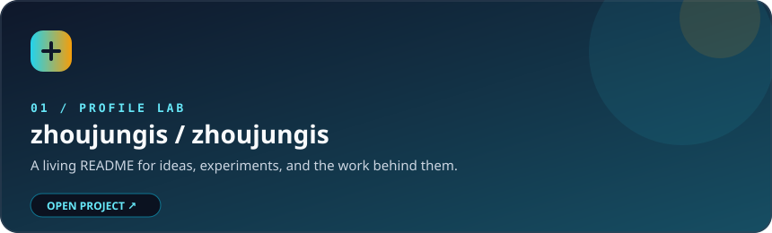
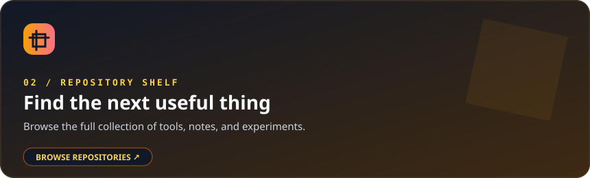
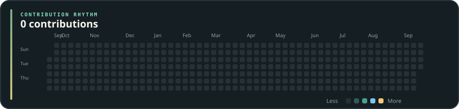

<div align="center">


<h1>Hi, I'm zhoujungis 👋</h1>

<p>
  <strong>Developer · Builder · Lifelong learner</strong><br />
  把想法做成产品，把复杂问题变成简单体验。
</p>

<p>
  <a href="https://github.com/zhoujungis?tab=followers"></a>
  <a href="https://github.com/zhoujungis?tab=repositories"></a>
  
</p>

</div>

<div align="center">


</div>

## 🧭 About me

```text
▸ I enjoy turning vague ideas into clear, useful interfaces.
▸ I care about readable code, thoughtful details, and steady iteration.
▸ I am always learning something new and sharing what I discover.
```

## ⚡ What I'm up to

| Focus | Current direction |
| :--- | :--- |
| 🛠️ Build | Small tools, experiments, and products with a real purpose |
| 📚 Learn | Better architecture, smoother UX, and reliable delivery |
| 🤝 Share | Open-source notes, reusable components, and practical lessons |

## 🧰 Toolbox

<div align="center">


</div>

## 📊 GitHub at a glance

<div align="center">


<br />


</div>

## 🌟 Pinned / selected work

<div align="center">

<a href="https://github.com/zhoujungis/zhoujungis"></a>
<a href="https://github.com/zhoujungis?tab=repositories"></a>

</div>

<p align="center"><sub>These cards are intentionally hand-designed for the profile. Add your strongest repositories to GitHub's actual pinned list so they appear beside this showcase.</sub></p>

## 🏆 Little trophy shelf

<div align="center">


</div>

## 📫 Let's connect

<div align="center">

<a href="https://github.com/zhoujungis"></a>
<a href="https://github.com/zhoujungis?tab=repositories"></a>
<a href="https://github.com/zhoujungis?tab=stars"></a>

<br />

<sub>Open to thoughtful conversations, interesting problems, and meaningful collaborations.</sub>

</div>

## 🟩 Contribution calendar

<div align="center">

<a href="./scripts/generate-contribution-calendar.mjs"></a>

<sub>Hand-drawn SVG · refreshed weekly by <a href="./.github/workflows/update-contribution-calendar.yml">GitHub Actions</a></sub>

</div>

<br />

<div align="center">


</div>
